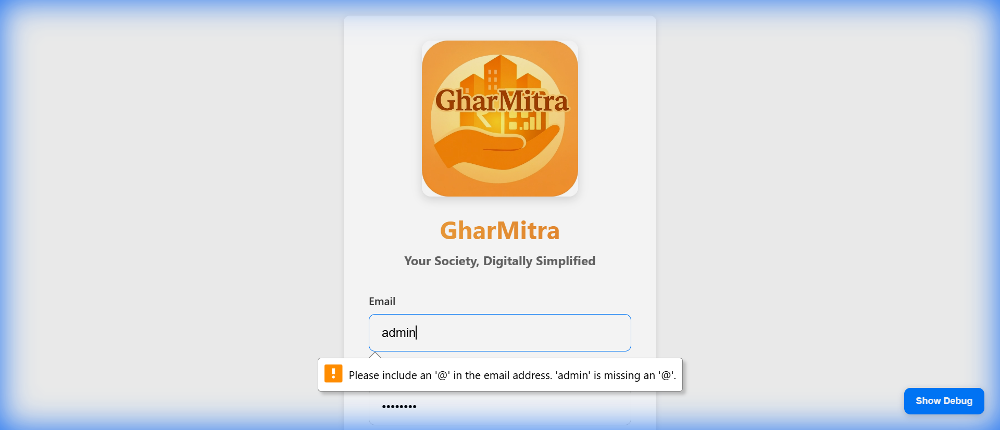
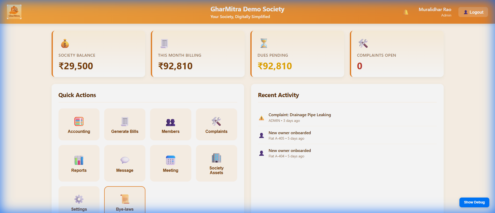
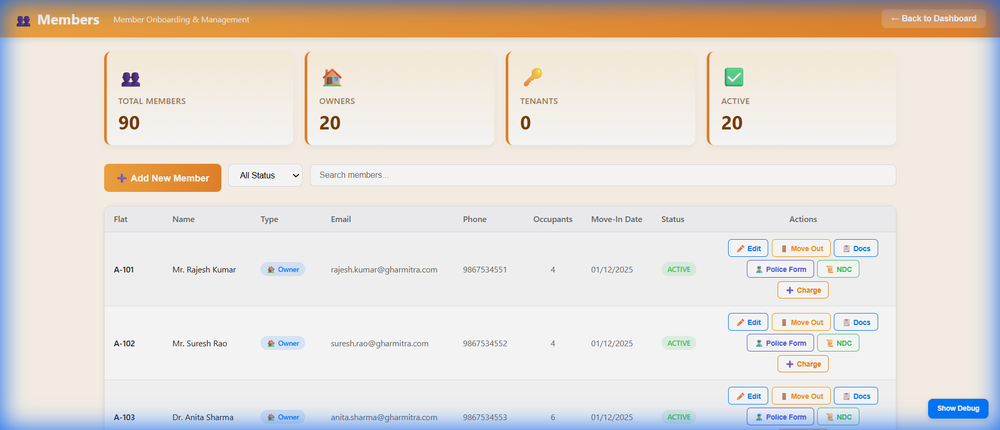
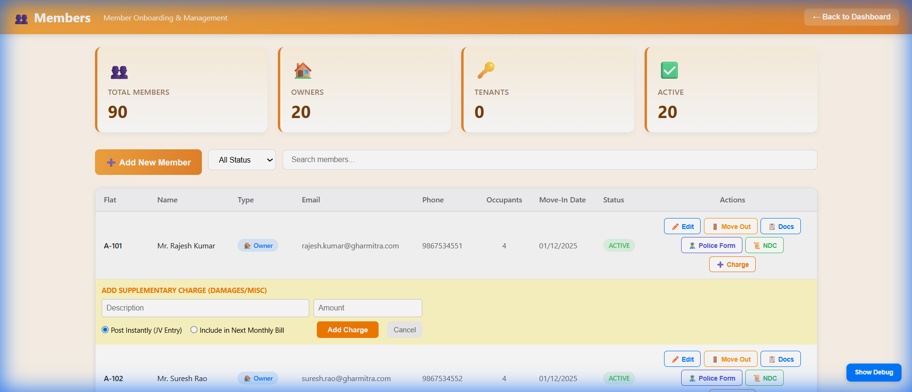
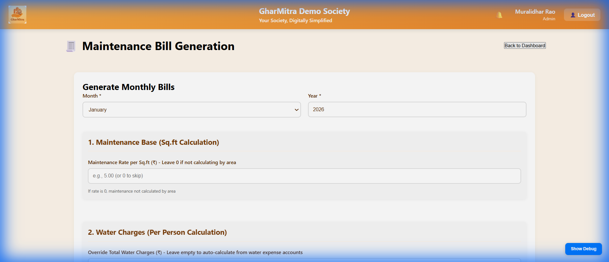
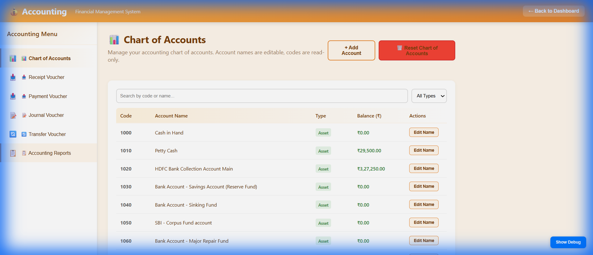
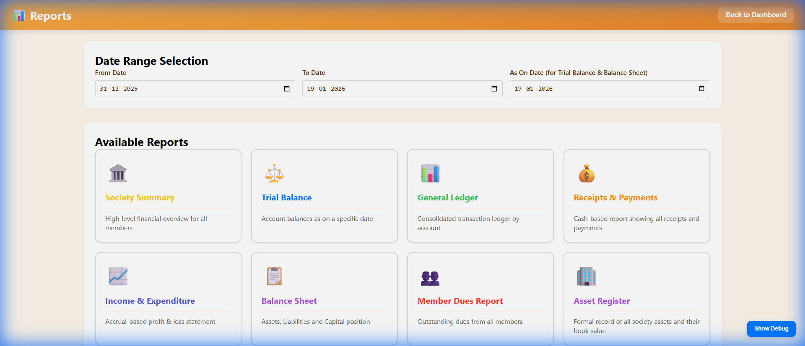
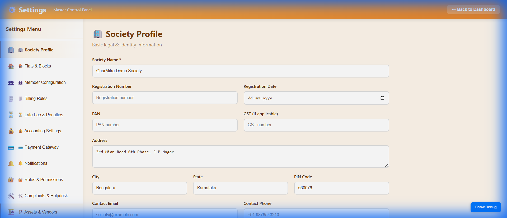

# GharMitra User Manual

Welcome to **GharMitra**, your comprehensive Housing Society Management System. This manual will guide you through the features and functionalities of the application.

---

## 🚀 Getting Started

### Login
To access the system, open the application and enter your administrator credentials.

*   **Email**: Enter your registered email (e.g., `admin@example.com`).
*   **Password**: Enter your secure password.
*   **Login**: Click the button to access the dashboard.

---

## 📊 Dashboard

The **Dashboard** is your central command center, giving you an immediate overview of your society's health.

**Key Features:**
*   **Financial Summary**: View total balance, income, and expenses at a glance.
*   **Billing Status**: See how many bills are generated, pending, or paid for the current month.
*   **Quick Actions**: Large, easy-access tiles to navigate to key sections like **Members**, **Accounting**, and **Reports**.

---

## 👥 Member Management

Manage all society members, including owners and tenants, from the **Members Screen**.

### Features:
*   **Member List**: View a sortable list of all flats and their occupants.
*   **Status Indicators**: Quickly see if a flat is Active, Rented, or Empty.
*   **Edit Details**: Click the "Edit" button to update contact info or occupancy status.

### ➕ Supplementary Charges (Damages/Recoveries)
You can levy special one-time charges on specific members (e.g., for facility damage or fines).

1.  Locate the member in the list.
2.  Click the **"Charge"** (or **"➕"**) button in the Actions column.
3.  A modal will appear:

4.  **Enter Details**:
    *   **Description**: Reason for the charge (e.g., "Broken window glass").
    *   **Amount**: The amount to be recovered.
    *   **Post Instantly**: Create a Journal Voucher immediately (debits member ledger).
    *   **Next Bill**: Add this charge to their next monthly maintenance bill.

---

## 💶 Maintenance Billing

Generate monthly maintenance bills for the entire society in just a few clicks.

*   **Select Month/Year**: Choose the billing period.
*   **Rates Configuration**: Adjust the default rates for maintenance, water, sinking fund, etc.
*   **Generate**: The system automatically calculates bill amounts for all flats based on active settings.
*   **Publish**: Post the bills to the member ledgers.

---

## 💰 Accounting

Complete double-entry accounting system to manage society finances.

### Chart of Accounts
View and manage your ledger accounts.

*   **Assets, Liabilities, Income, Expenses**: accounts are categorized automatically.
*   **Balances**: Real-time balance updates.
*   **Vouchers**: Navigate tabs to create **Receipts**, **Payments**, or **Journal Vouchers**.

---

## 📈 Reports

Access detailed financial and operational reports.

**Available Reports:**
*   **Member Dues Report**: See who owes what.
*   **Income & Expense Statement**: Profit/Loss overview.
*   **Balance Sheet**: Financial position of the society.
*   **Trial Balance**: For accounting verification.
*   **General Ledger**: Detailed transaction history for any account.

---

## ⚙️ Settings / Profile

Configure your society's core details.

*   **Society Name & Address**: Update official details for bill headers.
*   **Registration Number**: Legal registration info.
*   **Bank Details**: Add/Update society bank accounts for payments.
*   **Signatories**: Manage authorized signatories for documents.

---

**Need Help?**
Contact your system administrator or support implementation team for technical assistance.
